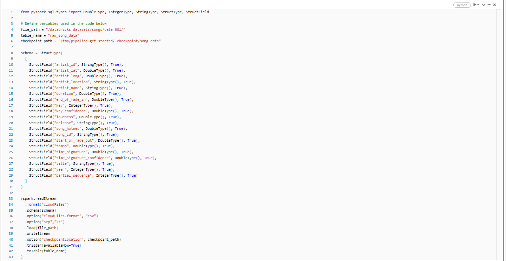
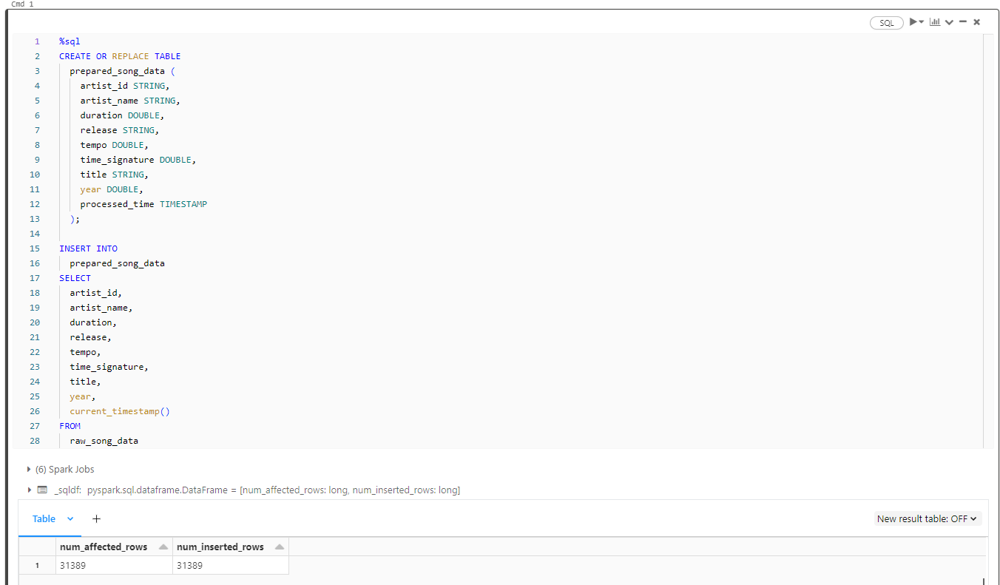
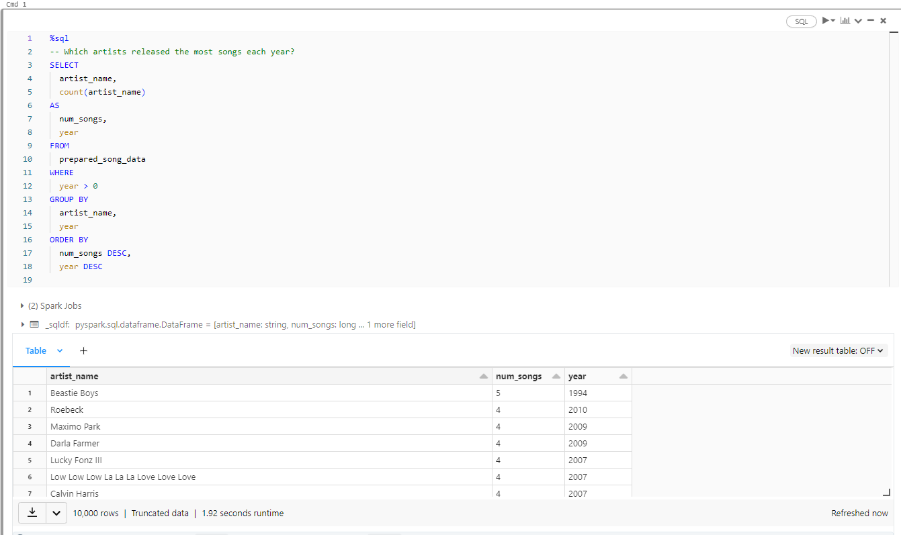
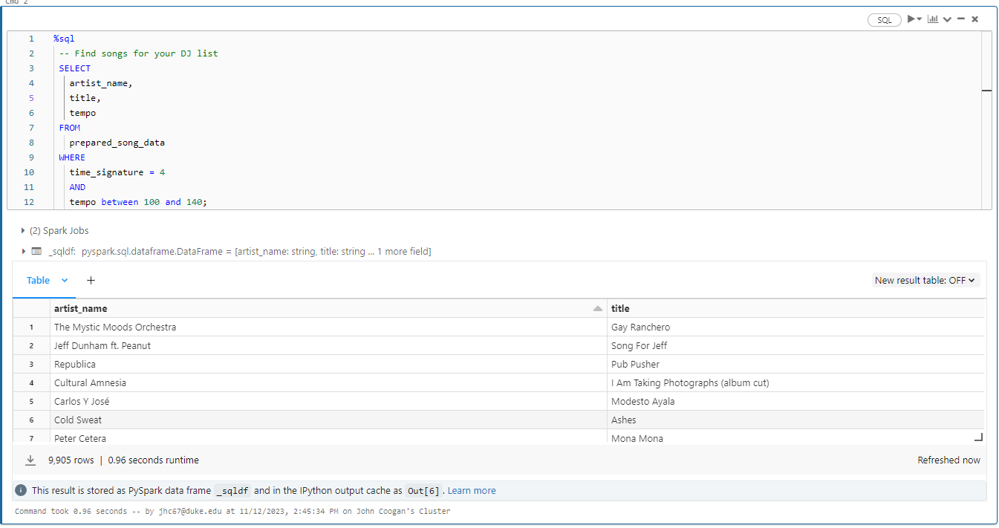
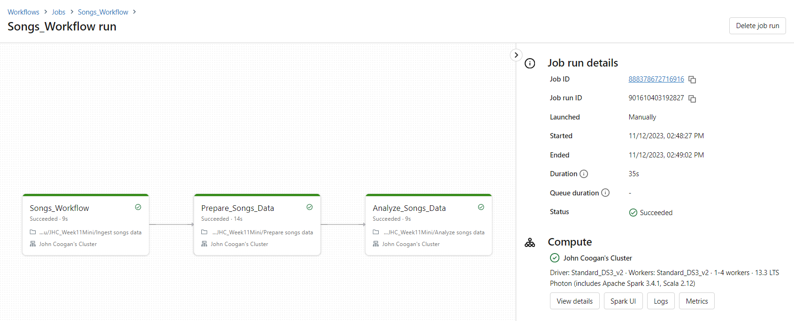

# Azure Data Pipeline
In this project we set up an automated data pipeline using azure databricks. This project uses the Databricks song dataset to demonstrate how multiple hosted notebooks can be used to Extract, Transform, and Load data on a schedule in an automated fashion. This capability is critical for working with frequently updated data or for performing repeat operations against a data sink. This project reads in raw data, prunes the data and stores it in a data sink, then queries the data through a databricks workflow. While this is a toy example of the process, this can easily be scaled for larger or more complex data to meet the agility requirements of buisiness intelligence decision making or other high tempo professional environments.

Each of these ETL steps have been abstracted into modular scripts to minimize complexity, facilitate readibility, and increase the ease with which the project is developed or scaled.

## Extract:
Below we see the ingestion or extract script for the raw data. This notebook reads the raw data from the songs dataset according to a defined schema:

## Transform and Load:
The image below shows the transform stage of the ETL pipeline. This notebook creates a table and inserts the song data into that table for future operations. This stage highlights the flexibility of working with hosted notebooks. One may notice that the extract stage is leveraging python's pyspark package while this transform stage seamlessly switches to SQL for database operations:

## Query:
Finally the images below show complex queries like artist release frequency or subsetting songs by time signature and tempo. This is a powerful demonstration of complex analysis which can be automated through a workflow:

## Workflow:
These individual stages are not particularly impressive on their own. It is when we use the workflow capability of Azure Databricks that we see the full automated data pipeline in action. The picture below shows the workflow dashboard and the intuitive user interface that allows for notebooks to be run sequentially on schedule. This gives easy control over the entire while making continuous development through notebook editing and repository backup highly robust:
